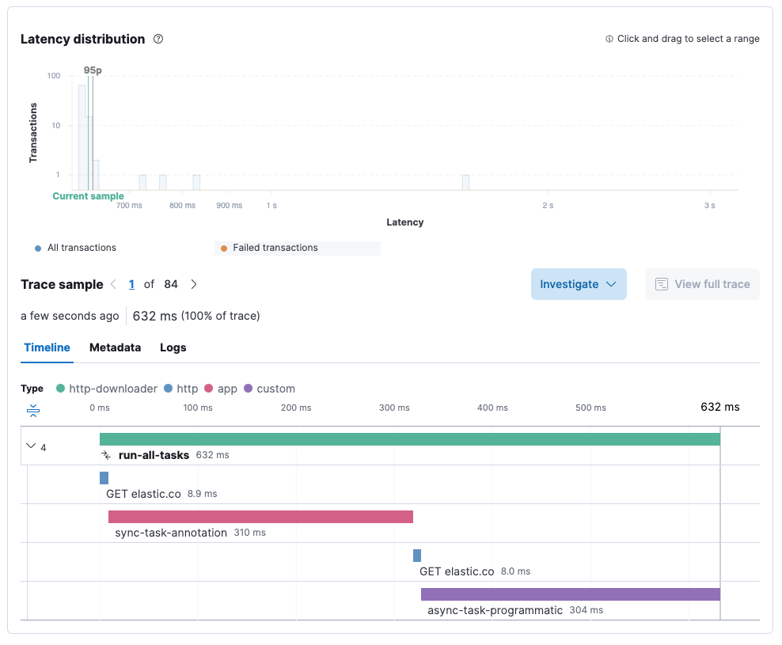
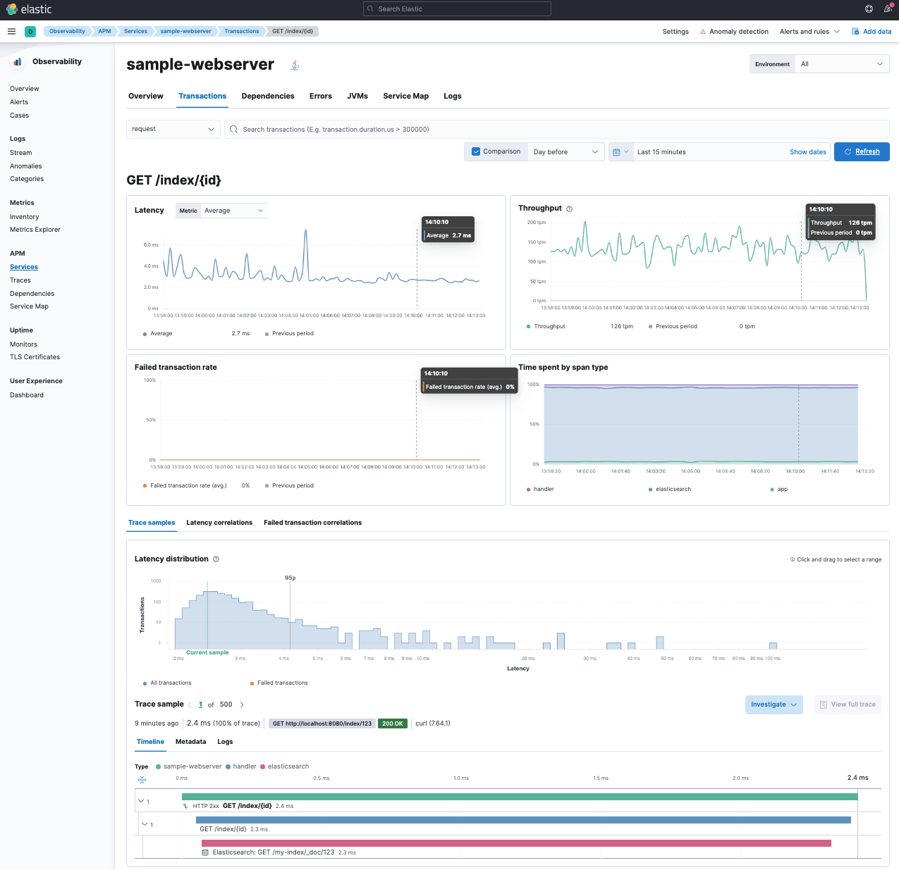

# Elastic APM with Java examples

This repository contains a few examples to get up and running with Elastic APM.

## Start the docker environment

The `docker-compose.yml` file starts up Elasticsearch, Kibana and an APM server. Run

```bash
docker compose up
```

and wait until all services are ready.

## HttpClient example

Make sure you have a recent java 17 installed, i.e. via `sdk`. Then you can run

```bash
./gradlew runHttpClient
```

Running this, you will see different kinds of traces. The fast ones
containing `elastic.co` in its names are HTTP requests using the built-in
HTTP client, which is auto instrumented. The `sync-task-annotation` is
instrumented via an annotation and the `async-task-programmatic` is
instrumented programmatically.



## Run the webserver

The second example is a Javalin webserver with several endpoints. Javalin is
also automatically instrumented by the Elastic APM agent.

```bash
./gradlew runWebserver
```

Now you can run the following curl calls (which will store data in
Elasticsearch):

```bash
# store product, one can pick an arbitrary id after /index/
curl -X PUT localhost:8080/index/123 -d \
  '{"title":"This is a title", "description":"Fancy description goes here"}'

# retrieve product again
curl localhost:8080/index/123

# run a search, which is implemented as a future
curl localhost:8080/search?query=fancy

# load template
curl localhost:8080
# also with parameter
curl localhost:8080?user=alex
```

Transactions look like this in the APM UI


